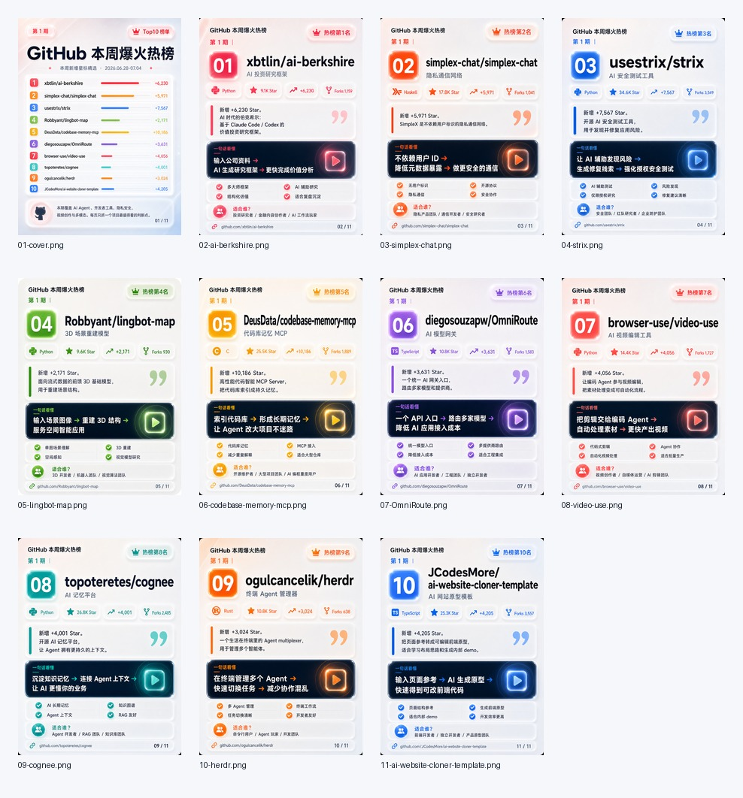

# Case: GitHub 本周热榜小红书图文笔记

This example shows the default full-package flow for:

```text
帮我做一个 GitHub 本周热榜的小红书图文笔记
```

## Input

- Source: GitHub Trending weekly
- Ranking size: Top10
- Output image count: 11
- Image ratio: 3:4
- Publish assets: images, clean zip, title options, caption, hashtags, and source records

## Output Preview



## Generated Package

The workflow produces:

- `00_source/github-weekly.json`
- `00_source/sources.md`
- `01_analysis/selection.md`
- `02_cards/cards.md`
- `02_cards/xhs_caption.md`
- `02_cards/visual_prompts.json`
- `03_images/01-cover.png` through `03_images/11-*.png`
- `manifest.json`
- `contact-sheet.jpg`
- `clean-3x4-only.zip`

## Validation Results

In the tested run:

- 11 images were generated;
- all 11 images were `1086x1448`;
- the clean zip contained only PNG card images;
- the cover had no repository link bar;
- detail cards used `热榜第N名`;
- trend metrics used `+数字` without `本周`.

## Caption Example

Title options:

1. GitHub本周热榜
2. 开源项目周榜
3. 程序员本周必看

Hashtags:

```text
#GitHub #开源项目 #程序员 #AI工具 #开发者工具 #效率工具 #技术分享 #小红书图文
```
